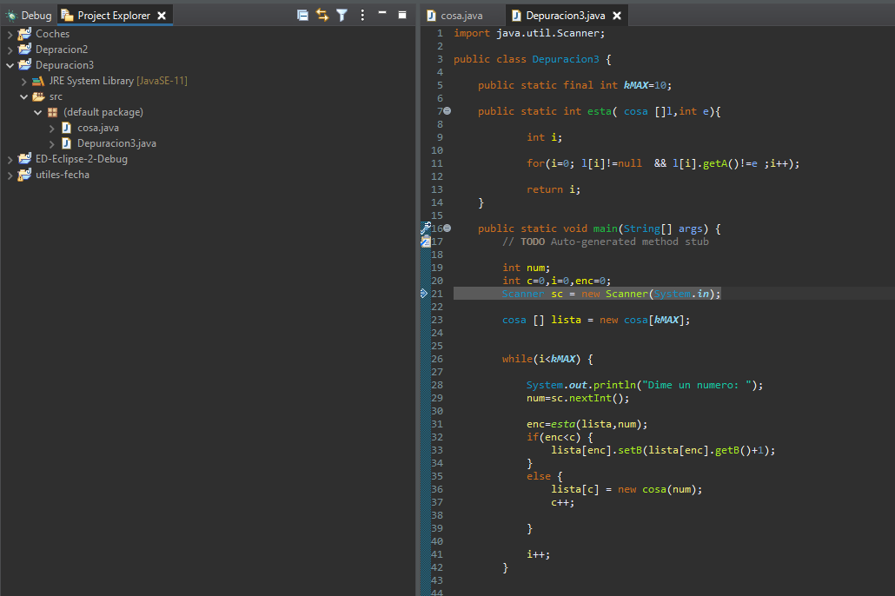

# Tarea 6 - Depuración 3.

#### 0. Importar el proyecto en vuestro WorkSpase en Eclipse.

#### 1. Explica qué hace el método main.

*Inicializa las variables de num, c, i e enc a 0 (ya que son tipo int), crear la Array cosa de tamaño kMAX (kMAX tiene un valor maximo de 10), después inicia el bucle.*

#### 2. Poner el punto de ruptura (breakpoint) en la línea 26 (primer bucle del método main) y, basándonoos en los valores que van tomando las variables, explicad qué hace y cómo funciona el método. Podéis crear tablas para ver cómo comabian los valores de las variables y del array.

*Comprueba que mientras i sea menor que kMAX pedira un valor que se le asignara a la variable "num", después de eso comprobara si enc es menor que c, si es asi ira pasando por el Array lista sumandole uno, si no es el caso se creara una nueva Array llamada cosa que el tamño sera del valor de la variable num y asu vez le suma 1 a la variable c, para terminar cada vez que comprueba todo este bucle le suma 1 a la variable i.* 

#### 3. Basándonos en el funcionamiento, determinad qué undican o a qué hacen referencia las variables "a" y "b" de la clase "cosa".

*La a señala el numero mienstras no se repita que sale y la ve las veces que aparece.*