# Tarea 6. Repaso GIT. Métdo Tostring en Java.

#### 1. Cread un fichero test.java con la clase test como sigue:

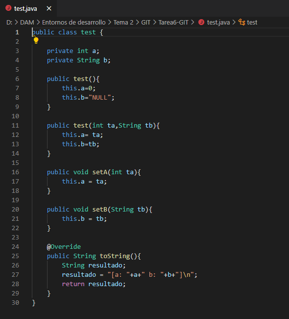

#### 2. Pasad a preparado el fichero.

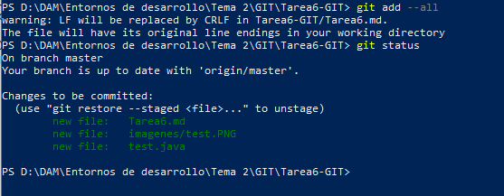

#### 3. Cread el fichero Principal.java.

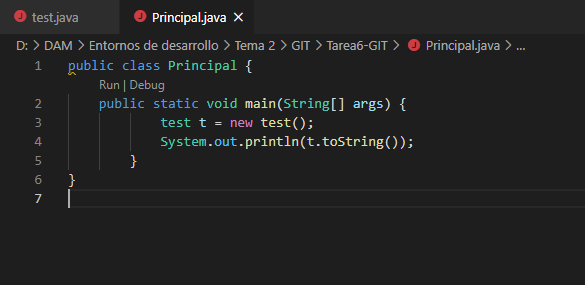

#### 4. Pasad a preparado el fichero.

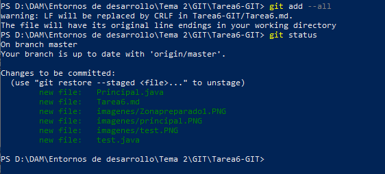

#### 5. Haced un commit con el comentario "Inicial clases test y principal".

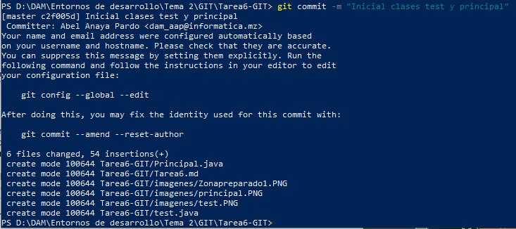

#### 6. Comprobar la salida del programa (debéis compilar los .java y probar el Principal).

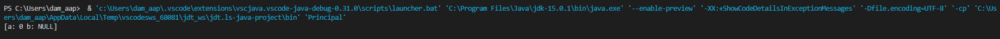

#### 7. Modificad el fichero test eliminando el método toString().

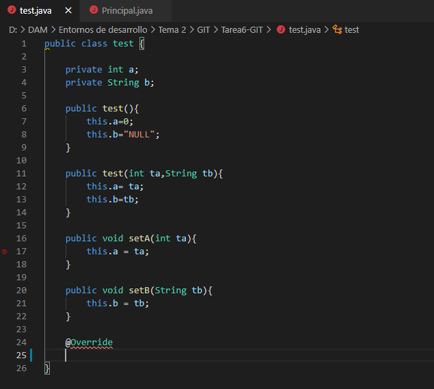

#### 8. Pasad a preparado el fichero.

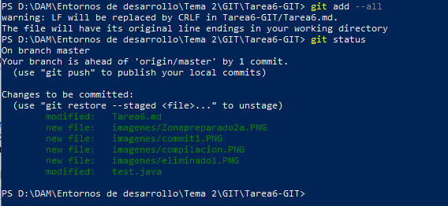

#### 9. Realizad un segundo commit “Eliminada ToString()”.

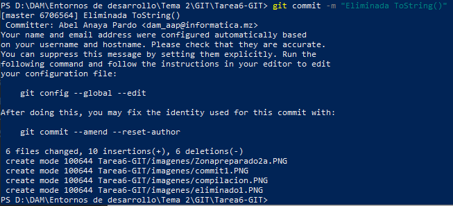

#### 10. Comprobad de nuevo la salida del programa.

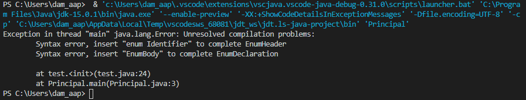

*Salta error debido al @Override*

#### 11. Volved atrás viendo los “log” y haciendo “checkout” necesarios para que la salida del programa sea la del paso 6. Responded a las preguntas en el markdown: ¿Qué creéis que hace el método toString? Y ¿Qué conseguimos con el @Override?

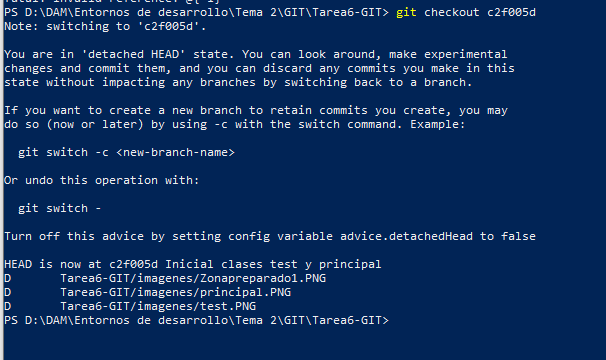

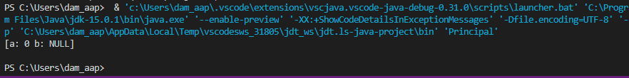

*Ahora vuelve a funcionar debido al checkout.*

